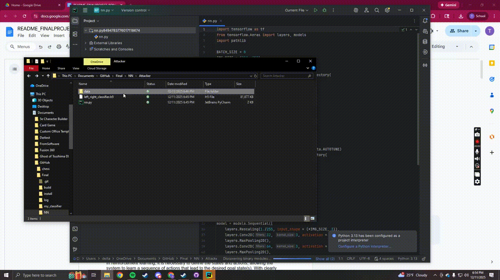
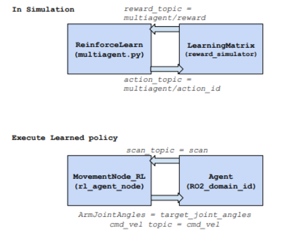
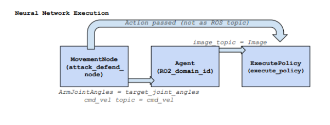

agent DEFEND, agent ATTACK Write-Up
Authors: Hanim Nuru, Trey Clark 
Course: CMSC 20600 - Intro Robotics
Git: 
Project Description: 
The goal of the project is to train both a defense and an attack robot using Neural Network classification and Multi-agent Reinforcement Learning allowing us to compare the efficiency of each in real time. The core components of the system include image classification, reinforcement learning, and robot kinematics. Comparing these two methods within the same ROS2 framework is particularly interesting because it highlights the tradeoffs between perception-based control (Neural Networks) and strategy-based control (Reinforcement Learning). This comparison provides a direct evaluation of latency, decision quality, and behavioral consistency, while offering insight into how learning-based systems perform under real-world physical constraints. 
For the neural network, we are required to train on labeled data, essentially images saved in different folders depending on what position was being recorded. For example the defender's neural network had right, center, and left and in the respective folders were images of the attacker with their weapon right,center, and left. The network, along with a bunch of fine tweaks and specific algorithms, then trains on 80% of the data and tests itself on 20% of the data to get an accuracy score.
 
Accuracy can be tricky to read, and too good of accuracy is more than likely overfitting, see below; however, we achieved a 100% accuracy for the attacker NN and for the defender NN. It should be noted here the attacker was a binary classifier, left or right, and the defender had three classes which is much more difficult. These scores also got a 100% validation score, which essentially means if we rerun the data in a different order it tests if how similar of a score we get to test for overfitting, achieving 100% means it's unlikely that there was overfitting, but I heavily doubt that, anecdotal accuracy is explained below. 
In reinforcement learning, it is necessary to define the states and actions, allowing the system to learn a sequence of actions that lead to the desired goal state(s). With clearly defined states and actions for the robot, both robots were trained to select action sequences that guided them toward achieving their goal states (successful block or attack).

System Architecture: 
The system implements a simulated robotic environment in which attack and defense agents interact in a competitive scenario. The architecture relies heavily on ROS2 publish/subscribe mechanisms to enable real-time communication between nodes. It should be noted two different systems are required, one to publish to the defender and one to publish to the attacker.

Neural Network: 
FILE_PATHS = Final/NN/attack, Final/NN/defend
The script recored_images.py was used to record data. The simple script asked for a file path where to save the images, and then on keyboard input it saved the captured frame from the robot camera to that path. Even with this, data gathering took hours, as we gathered about 40 for each class, and there are 5 (attacker_left, attacker_right, defender_left, defender_center, defender_right) and the more varied the data the more robust the model. 

After collection the script NN was run in its own directory with access to a folder labeled “data” for which the multiple folders containing the classes were found. You could vary the parameters and model to achieve longer runtimes, but with simple settings it only takes about 5 minutes to run this on the CSIL machines (which to my knowledge do not have a dedicated graphics card). From these scripts the model was saved so that it could be pre-loaded execute-policy and be used to make predictions. 

Reinforcement Learning: 
Path = (/home/hanimn/intro_robo_ws/src/Final/src_defend_agent_attack/defendagentattack/)
Sense —> Agent: The system uses sensor scans to provide real-time environmental feedback. This ensures that robots maintain a safe distance from each other. Sensor feedback is integrated with movement controls, restricting robot motion for a minimum duration defined by (action_MIN_RUN_TIME)  and the scan_callback function. 
Path/defendagentattack/rl_agent_nodes.py 
Attack/Defense Agent for simulation: Each agent determines its next action based on the reinforcement learning algorithm. During simulation, individual actions are combined to form a joint action.
Path/defendagentattack/multiagent.py
This process requires assessing the validity of actions based on the current state. Validity constraints include; Both agents must select only one action per turn and If the body state is home, the arm state must also be home.
Path/matricies/state_nstate_generate.py 
Agent → Reward Simulation: Agent actions are evaluated based on human-defined criteria to determine their effectiveness. Reward values for these actions are initialized in the LearningMatrix node in the path below. 
Path/defendagentattack/reward_simulator
During simulation, this evaluation is performed on the combined joint action of all agents. The joint action data is published by the multi-agent algorithm, allowing the reward simulator to assign appropriate feedback to each agent.
Path/defendagentattack/fightnow.py 
Agent Movement Execution: Movement for each agent is executed based on the actions it selects. These actions are implemented within their dedicated node, which also processes sensory input. Conditional logic within the node determines the appropriate movement, ensuring that each action is carried out according to the current state of the environment.
Path/defendagentattack/rl_agent_nodes.py 
Attack/Defense Agent during policy execution: This step involves communication across ROS2 domains. Within the agent class, this is handled by main() and reading_file() functions. The main() function identifies which ROS2 domain is associated with each agent, ensuring proper coordination. The reading_file() function allows each agent to record its preferred next action, which is then combined with other agents’ actions to form a joint action for execution.
Path/defendagentattack/fightnow.py 

ROS Node Diagram 
Reinforcement Learning:
 
  

  
Execution
After building the ROS2 packages, you can run the appropriate commands depending on the algorithm you wish to use:
Neural Network: ros2 run my_classifier execute-policy
RL: ros2 run defendagentattack fight-now
Upon execution, the program will prompt you to specify whether your computer/ROS2 domain is associated with the defending agent (2) or the attack agent (1).
Neural Network execution:
 For the neural network, after each action is performed, determined by the classification model,the program will ask whether the attack robot successfully popped the balloon. This requires user input for each step.
Reinforcement Learning execution:
 For the RL algorithm, the policy execution is followed by learning a multi-agent matrix for state-action pairs. Once you indicate which robot you are associated with, no further user input is required. Note that the game will continue running indefinitely until interrupted via the keyboard. 
Arm Movement: In addition to the command above, executing arm movements requires running the following command: ros2 run omx_cpp_interface arm_cmd 

Challenges
For both algorithms, movement was implemented separately because, once an action was chosen, the method used by the algorithm to arrive at that action was less important than consistently executing the movement itself. With this in mind, we aimed to generalize the movement logic so that either algorithm could produce reliable, predictable behavior across both robots.This proved challenging because the neural network and reinforcement learning pipelines relied on state representations and message structures, making it difficult for a single node to interpret actions consistently. As a result, I ultimately had to create two separate nodes for the Attack robot: one for NN execution and one for RL execution.
Another challenge common to both algorithms involved maintaining synchronized movement. Robots could fall out of sync with their expected states, leading to inconsistencies in behavior. This reflects a broader real-world issue: movement control is highly sensitive to timing, hardware response, and environmental noise. Our practical workaround was to constrain each action to a fixed time window or wait for keyboard input, ensuring that movements would terminate predictably.
For the neural network classification, we observed that predictions were accurate for the binary classifier, not 100% but definitely above 80%. However, the classifier with 3 classes felt maybe 50% accurate, which is still better than the statistical average of 33%, but nowhere near the 100% it was promising. My guess is the data set wasn’t necessarily overfitting to the data, but more that data was only collected in two separate shots, so in those conditions it may get something like 100%, but generalized to anywhere in the room it significantly got worse. 
A significant challenge for MARL execution was the need for inter-robot communication. We implemented this using a text file that could be read from and written to as needed, allowing simultaneous initialization of movement and helping to synchronize actions between the robots.
Just in general we’ve experienced a lot of non-deterministic errors with every robot, and requiring two with working arms obviously made this much worse. So with every step of positive progress we were fighting with double the amount of inconsistencies. 

Future Work 
Having viewable movement is paramount to improving this project. The “dual” became more of just a test of a classifier than an actual spectacle, making the 3D printed armaments just a splotch of pixels that may help or hurt the classifiers. If this were to be picked up again it is paramount that this spectacle movement can be done even before testing a classifier, then applying the classifier, and then from there improving upon both aspects. 
One potential improvement is to incorporate additional movement actions into the MARL execution. Expanding the action space in the MARL algorithm would allow agents to explore a richer set of strategies and adapt more effectively to dynamic environments, compared to the classification model, which requires extensive training on a single state to learn effectively. Another promising direction is to extend the neural network into a continuous learning system, enabling it to incorporate new classifications dynamically as additional data becomes available. This would make the model more adaptive and scalable over time.
We were unable to compare the efficiency and decision-making performance of the two algorithms. In the future, it would be interesting to quantify these differences once both implementations are fully functional.

Takeaways
Neural networks are both highly sensitive and not at all, which sounds like a nothing statement but hear me out. It did incredibly well noticing the small pixel difference that the armaments and robot arm, the “100%”, however it is terrible at applying that differentiation with different backgrounds. The real answer to fix this would be more data, but “good” neural networks require thousands of properly labeled data which is borderline impossible for this class.
Budget so much time for kinematics. Every point of movement is a possible point of failure and this alone should cause concern to allocate a great deal of time; worse comes to worse and everything goes without a hitch. We were not so lucky.
We were also interested in how learning-based systems, such as MARL, are constrained by practical issues like inter-robot communication (since a single computer cannot connect to two ROS domains simultaneously), timing, and synchronization. These real-world constraints often have a greater impact on performance than the logical steps of the algorithm itself.

